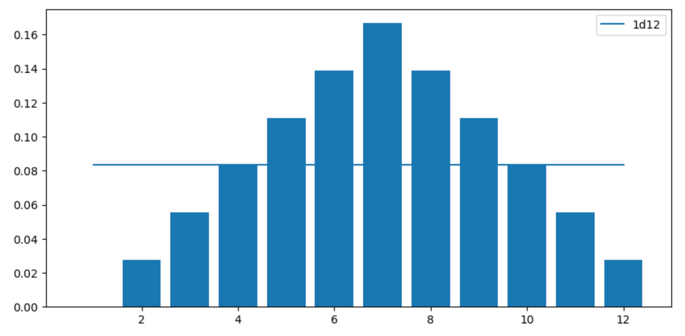
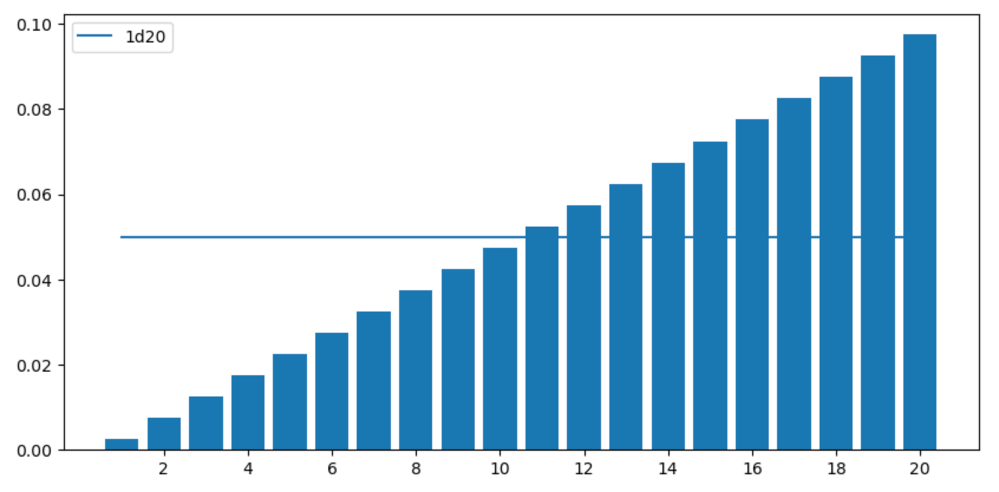

Have you ever been a DM and wondered what it means to roll with disadvantage? Or why some weapons are 2d6 instead of 1d12? It all has to do with the statistics of dice rolls!

<!--more-->

Let's start with something pretty basic to understand. If you are rolling a single dice, there is an equal probability of any number landing face up. This means a flat distribution across the board. 

### Taking the Sum of 2 Dice

Now instead of rolling a single dice, we'll take the sum of two dice. So instead of rolling 1d12, we can roll 2d6. The first obvious change is that now it's no longer possible to roll a 1. However, the distribution is now also way different! Averages values (like a 6, 7, 8) are way more likely than the extremes (a 2 or a 12).

Here's a fairly straightforward snippet of code to help us analyze the distribution. We're getting the every combination from 2 dice rolls, summing them, and then tallying up each sum. 

```
def distribution_sum(a, b):
    result = []
    total = max(a)*max(b)
    for roll_1 in a:
        for roll_2 in b:
            result.append(roll_1 + roll_2)
            
    x = np.arange(1, max(result)+1)
    y = np.zeros(max(result))
    for sum in result:
        y[sum-1] += 1
    return x, y/total
```

When we plot the results, we can see that the sum of two dice is actually **not** a bell curve (yet), but a triangle. 

{: .center-image }

But what if we increase the difference between the two die used (e.g. d12 and d8)? We also "flatten" the top. You can think of this as the bigger dice "enveloping" the smaller dice so to speak. 

{: .center-image }

### Sum of More than 2 Dice

When we increase the number of dice (for example, 3d4 instead of 1d12), we end up both flattening the curve, as well as shifting it to the right. Here's a few examples all together:

{: .center-image }

### Rolling with Advantage/Disadvantage

When you roll with advantage, you roll two dice and take the higher value. We could take the same approach as before, and find every combination, compare the results, and only record the higher value, and that code would look like this:

```
def distribution_advantage(a):
    result = []
    total = max(a)**2
    for roll_1 in a:
        for roll_2 in a:
            result.append(max([roll_1, roll_2]))
            
    x = np.arange(2, max(a)+1)
    y = np.zeros(max(result)-1)
    for sum in result:
        y[sum-2] += 1
    return x, y/total
```

But there's a faster way to come to an answer. Let's say that on one d20 die you rolled a 20. This means that the other die can be literally anything, and you'd still take the 20. But now let's say you roll a 2 on the first die. Well now there's only one number on the other die for which you'd still take the 2 from the first die.

So the idea I'm trying to convey here is that larger numbers are *dominant* over smaller numbers, in the same way as with dominant and recessive genes. So back to our previous analogy, all 20 combinations with a 20 results in a 20, but only 1 combination with a 1 results in a 1 (whew take a second to digest that, that was confusing).

All this means that a 20 is going to be about 20 times more likely than a 1 in a roll with advantage. If we plot the distribution, it'll look something like this.

{: .center-image }

Rolling with diadvantage is going to be the same, but in reverse, where 1 becomes more likely, and 20 becomes less likely. 

The weighted average of an advantaged d20 roll (result * probability) is 13.825, compared to 10.5 for a straight roll. In other words, you can think of an advantaged roll as approximately equivalent to adding 3.325 to a roll. 

### Conclusion

And that's it! Those should cover most cases you'll encounter as a player or DM. Next up, a chapter on why paladin crits are ridiculous. 

